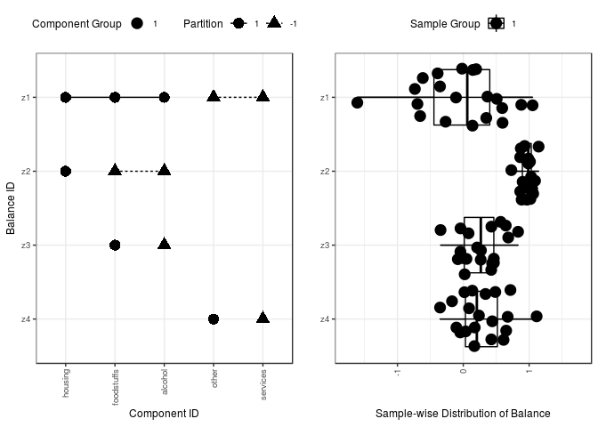
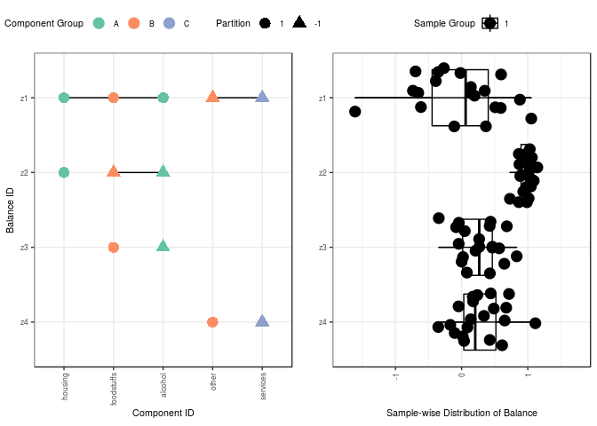
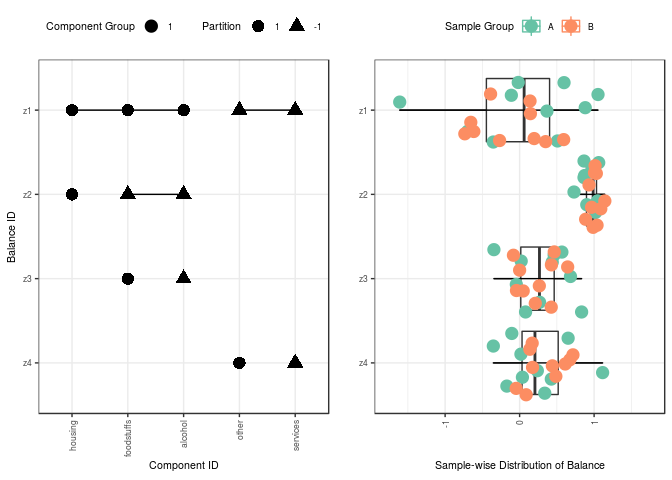
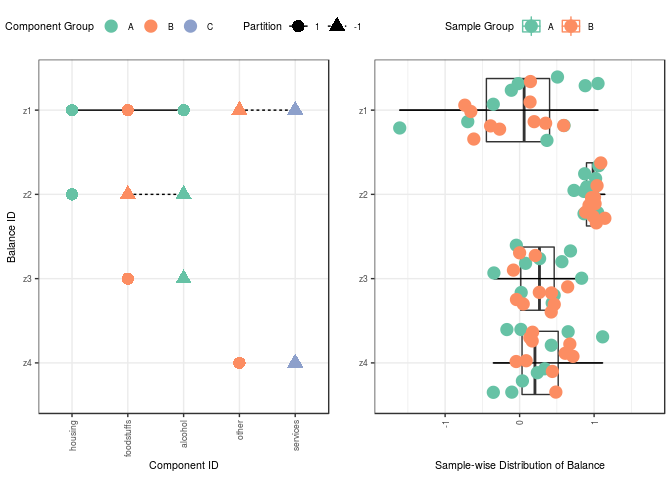
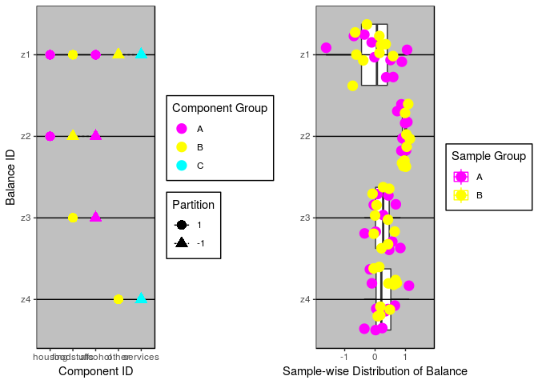

<!-- README.md is generated from README.Rmd. Please edit that file -->
Quick start
-----------

Welcome to the `balance` GitHub page!

Balances have become a cornerstone of compositional data analysis. However, conceptualizing balances is difficult, especially for high-dimensional data. Most often, investigators visualize balances with "balance dendrograms". However, this visualization tool does not scale well for large data. This package provides an alternative scheme for visualizing balances.

``` r
library(devtools)
devtools::install_github("tpq/balance")
library(balance)
?balance
```

Generating balance figures
--------------------------

We will demonstrate this package using an example from the `robCompositions` package. The "expenditures" matrix contains 20 compositions (row), each measuring 5 components (columns). As compositional data, the abundances are irrelevant and each composition sums to unity. The "y1" matrix is a serial binary partition (SBP) matrix that describes how to partition the 5 components into 4 balances.

``` r
data(expenditures, package = "robCompositions")
y1 <- data.frame(c(1,1,1,-1,-1),c(1,-1,-1,0,0),
                 c(0,+1,-1,0,0),c(0,0,0,+1,-1))
colnames(y1) <- paste0("z", 1:4)
```

With the data loaded, we can calculate and visualize the balances.

``` r
res <- balance(expenditures, y1, size.text = 8)
#> sROC 0.1-2 loaded
```



Optionally, users can color components (in left figure) or samples (in right figure) based on a user-defined grouping. To do this, users must provide a vector of group labels for each component via the `d.group`argument (or for each sample via the `n.group` argument). Due due to limitations imposed by the palette, there is a maximum of eight groupings allowed per vector.

Here, we color components by a user-defined grouping.

``` r
res <- balance(expenditures, y1, d.group = c("A", "B", "A", "B", "C"), size.text = 8)
```



Here, we color samples by a user-defined grouping.

``` r
res <- balance(expenditures, y1, n.group = c(rep("A", 10), rep("B", 10)), size.text = 8)
```



Here, we do both.

``` r
res <- balance(expenditures, y1,
               d.group = c("A", "B", "A", "B", "C"),
               n.group = c(rep("A", 10), rep("B", 10)),
               size.text = 8)
```



Modifying balance figures
-------------------------

The `balance` function returns a list containing the "partition" `ggplot` object, the "distribution" `ggplot` object, and the per-sample balances.

``` r
library(ggthemes)
custom1 <- res[[1]] + theme_excel() + scale_colour_excel()
#> Scale for 'colour' is already present. Adding another scale for
#> 'colour', which will replace the existing scale.
custom2 <- res[[2]] + theme_excel() + scale_colour_excel()
#> Scale for 'colour' is already present. Adding another scale for
#> 'colour', which will replace the existing scale.
balance.combine(custom1, custom2)
```


